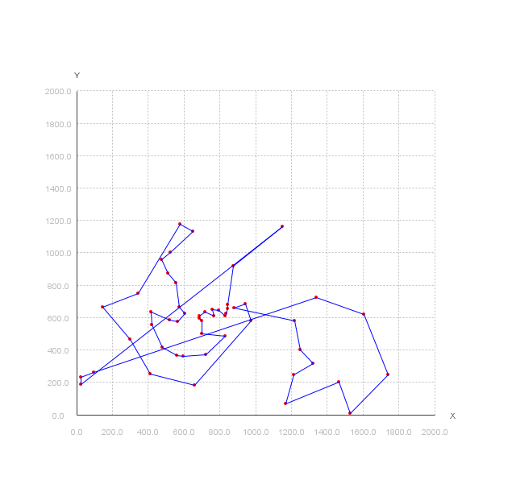

# Problema del viajante
Partimos de uno de los problemas de optimización combinatoria más conocidos:  encontrar el circuito de menor coste, dadas una serie de ciudades, que parta de una ciudad y recorra el resto una única vez, volviendo a la ciudad de origen.

Si no le damos importancia a la ciudad de origen, tendríamos $(n-1)!$ rutas posibles. 
En cambio, si tenemos en cuenta la ciudad de origen, obtenemos $n!$ rutas posibles.

Por la dificultad de encontrar soluciones a problemas NP-completos, empleamos técnicas que den con soluciones aceptables en un tiempo computacionalmente prudente.

> [!info] Búsqueda voraz Exhaustiva
> Según [Wikipedia](https://es.wikipedia.org/wiki/Algoritmo_voraz) y los [apuntes de la asignatura](https://aulasvirtuales.uhu.es/pluginfile.php/211603/mod_resource/content/12/TEMA3_1_AMC_19_20.pdf)[^1] podemos entender que el algoritmo voraz es  una estrategia de búsqueda que se centra en buscar la solución más óptima en cada paso local/iteración para así intentar alcanzar la solución general óptima, que no es más que la solución que más se aproxima a la función objetivo. 
> Podríamos decir que su principal desventaja es que, una vez toma una decisión, no puede retroceder.

# Aproximaciones
## Unidireccional exhaustiva
En esta aproximación, partiendo de una ciudad aleatoria, nos desplazamos a su ciudad más cercana, y una vez en ella, volvemos a desplazarnos a su ciudad más próxima[^2] ==que no haya sido visitada==. Esto quiere decir que sólo comprobamos las distancias en la cola (tail) de la cola/array. Hay que tener en cuenta que con esta estrategia de búsqueda no podemos retroceder, es decir, una vez hemos establecido como ciudad actual la que tenía menor distancia con la anterior, sólo podemos comprobar distancias con esta ciudad y no con las anteriores.
## Bidireccional exhaustiva
En esta aproximación, partiendo de una ciudad aleatoria, nos desplazamos a su ciudad más cercana, y una vez en ella, volvemos a desplazarnos a su ciudad más próxima[^2] ==que no haya sido visitada==. Comprobamos las distancias en la cola (tail) y cabeza de la cola/array. Hay que tener en cuenta que con esta estrategia de búsqueda no podemos retroceder, es decir, una vez hemos establecido como ciudad actual la que tenía menor distancia con la anterior, sólo podemos comprobar distancias con esta ciudad y no con las anteriores.
## Unidireccional con Poda
En esta aproximación, partimos ordenando el array por la coordenada x del punto.
Partiendo de una ciudad aleatoria, empezamos a recorrer el array buscando la ciudad más cercana, y una vez en ella, volvemos a desplazarnos a su ciudad más próxima[^2] ==que no haya sido visitada==. Esto quiere decir que sólo comprobamos las distancias en la cola (tail) de la cola/array. Hay que tener en cuenta que con esta estrategia de búsqueda no podemos retroceder, es decir, una vez hemos establecido como ciudad actual la que tenía menor distancia con la anterior, sólo podemos comprobar distancias con esta ciudad y no con las anteriores.
La diferencia con respecto a la exhaustiva es que, como los puntos están ordenados por coordenada X, si la distancia entre las dos coordenadas X de los dos puntos a comparar es mayor (o igual) que la distancia mínima actual, quiere decir que, por lo menos, la distancia mínima de esos dos puntos y los siguientes va a ser igual o mayor a la mínima actual. Por eso mismo, es posible realizar la poda y no hacer comparaciones innecesarias. 
## Bidireccional con Poda
En esta aproximación, partimos ordenando el array por la coordenada x del punto.
Partiendo de una ciudad aleatoria, nos desplazamos a su ciudad más cercana, y una vez en ella, volvemos a desplazarnos a su ciudad más próxima[^2] ==que no haya sido visitada==. Comprobamos las distancias en la cola (tail) y cabeza de la cola/array. Hay que tener en cuenta que con esta estrategia de búsqueda no podemos retroceder, es decir, una vez hemos establecido como ciudad actual la que tenía menor distancia con la anterior, sólo podemos comprobar distancias con esta ciudad y no con las anteriores.
La diferencia con respecto a la exhaustiva es que, como los puntos están ordenados por coordenada X, si la distancia entre las dos coordenadas X de los dos puntos a comparar es mayor (o igual) que la distancia mínima actual, quiere decir que, por lo menos, la distancia mínima de esos dos puntos y los siguientes va a ser igual o mayor a la mínima actual. Por eso mismo, es posible realizar la poda y no hacer comparaciones innecesarias. 

> [!warning]- Dependencias
> Vamos a hacer uso de la librería externa [JMathPlot](https://github.com/yannrichet/jmathplot/tree/master)
> Gestionamos su dependencia con Maven por lo que no deberíamos hacer nada al respecto para ejecutar el programa en otro dispositivo 

# Estudios realizados
## Datasets
### berlin52
#### Unidireccional Exhaustiva

#### Bidireccional Exhaustiva
![[berlin52BiEx.png]]
#### Unidireccional Poda
![[berlin52UniPoda.png]]
#### Bidireccional Poda
![[berlin52BiPoda.png]]
### ch130
#### Unidireccional Exhaustiva
![[ch130UniEx.png]]
#### Bidireccional Exhaustiva
![[ch130BiEx.png]]
#### Unidireccional Poda
![[ch130UniPoda.png]]
#### Bidireccional Poda
![[ch130BiPoda.png]]
### ch150
#### Unidireccional Exhaustiva
![[ch150UniEx.png]]
#### Bidireccional Exhaustiva
![[ch150BiEx.png]]
#### Unidireccional Poda
![[ch150UniPoda.png]]
#### Bidireccional Poda
![[ch150BiPoda.png]]
### d493
#### Unidireccional Exhaustiva
![[d493UniEx.png]]
#### Bidireccional Exhaustiva
![[d493BiEx.png]]
#### Unidireccional Poda
![[d493UniPoda.png]]
#### Bidireccional Poda
![[d493BiPoda.png]]
### d657
#### Unidireccional Exhaustiva
![[d657UniEx.png]]
#### Bidireccional Exhaustiva
![[d657BiEx.png]]
#### Unidireccional Poda
![[d657UniPoda.png]]
#### Bidireccional Poda
![[d657BiPoda.png]]

## Comparación estrategias

> [!info] ¿Qué estrategia es mejor?
> He tomado como mejor estrategias aquellas que dan como resultado una distancia / recorrido total menores 

> [!note] TLDR
> Aunque el rendimiento de estos algoritmos depende bastante de los datos usados en el estudio y de la posición (ciudad) inicial, podemos ver que, por lo general, el bidireccional acaba siendo una mejor estrategia si buscamos mayor precisión o exactitud. Sin embargo, hay que tener en cuenta que, para obtener mayor exactitud, estamos sacrificando tiempo de computación. 
> Las cuatro aproximaciones son buenas estrategias y cada una tendrá su uso dependiendo de la simplicidad, velocidad de ejecución y/o precisión en el resultado que busquemos.
> (sin olvidar que ninguna de ellas es 100% precisa por la dificultad de encontrar la solución óptima a problemas NP-completos).

### Exhaustivas
#### Tabla
|        | Uni Exhaustiva |              | Bi Exhaustiva |              |
| ------ | -------------- | ------------ | ------------- | ------------ |
| tallas | Tiempo(mseg)   | nVeces mejor | Tiempo(mseg)  | nVeces mejor |
| 1500   | 36.133         | 1            | 107.496       | 9            |
| 2000   | 37.337         | 4            | 74.738        | 6            |
| 2500   | 57.239         | 5            | 115.761       | 5            |
| 3000   | 81.979         | 3            | 165.191       | 7            |
| 3500   | 110.496        | 7            | 223.949       | 3            |
#### Gráfica tiempo
![[AMC_MemoriaP2-1.png]]
#### Gráfica veces mejor
![[AMC_MemoriaP2_GrafVecesMejor.png]]
### Poda
#### Tabla
|        | Uni Poda     |              | Bi Poda      |              |
| ------ | ------------ | ------------ | ------------ | ------------ |
| tallas | Tiempo(mseg) | nVeces mejor | Tiempo(mseg) | nVeces mejor |
| 1500   | 22.540       | 4            | 35.022       | 6            |
| 2000   | 38.860       | 1            | 67.396       | 9            |
| 2500   | 59.179       | 3            | 106.589      | 7            |
| 3000   | 85.866       | 2            | 140.793      | 8            |
| 3500   | 108.853      | 2            | 152.063      | 8            |

#### Gráfica tiempo
![[AMC_MemoriaP2GrafTiempoPoda.png]]
#### Gráfica veces mejor
![[AMC_MemoriaP2GrafVecesMejorPoda.png]]

[^1]: Diapositiva [48-52] del Tema 3 
[^2]: De manera exhaustiva